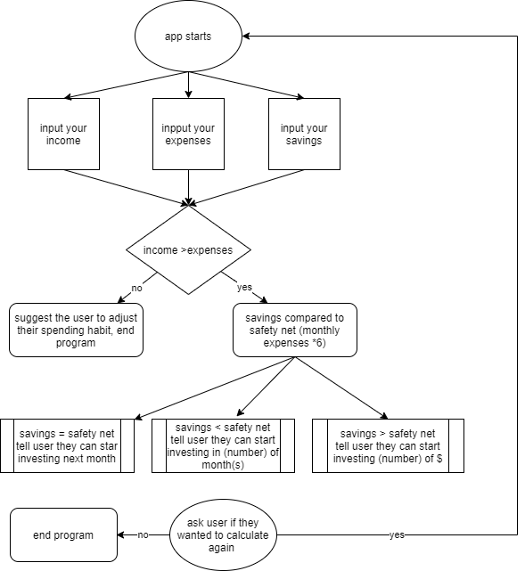

<h1>SOFTWARE DEVELOPMENT PLAN (FORTUNE PIGGY)<h1>

<h2>Purpose and scope of the application<h2>

<h3>SO what's the goal of this application<h3>

FORTUNE PIGGY application will suggest whether you should invest your money or not and how much, bases on your monthly income, your expenses and your current savings.

<h3>What problem will it solve and target audience<h3>

The application is going to tackle a problem lots of people are facing, if not one of the most important aspect of our life, our financial status.
Our early saving and investment is going to dictate whether we're going to have a safe and easy retirement or not. Making investment early means you're on your way to the ultimate financial goal : FINANCIAL FREEDOM, where you can fund and sustain yourself without working for the rest of your life, where you do something because that's what you like, not what you need to do. A lots of people having are having trouble saving money in early stage of their career, even later on. Living paycheck by paycheck, spending money you dont have, max out your credits card is not an uncommon lifestyle, especially among millennials. And this doesn't mean you have to cut off all your spending in able to do this, it means you have to be consious about your own finance and dont spend more than what you make.

<h3>How it works<h3>

So in FORTUNE PIGGY, you're going to put in your mothly income, your expenses and your current saving, it will calculate the money you need if you're not working for 6 months, in case you lose your job tommorow, that money is called a "safety net"
It will return whether you should invest now and if you shouldn't, how long you have to wait until you can. If you were ready to invest, it will tell you how much you should put in your investment. All of this is based on your own references.

<h2> *FEATURES <h2>

<h3>App logo<h3>
It will create an app logo when you started running the program by using lolcat and figlet gem.
<h3>User Input<h3>
The app is going to ask user to in put their name and numbers for the calculation. If user enters something other and a number when the app asked it will return an error message and it will ask user to enter it again until user enter a valid number. This feature uses tty-prompt gem.
<h3>rerun the application<h3>
when it finished the calculation it will ask you if you want to run the app again by typing yes or quit the app by enter any key.

<h3>Gem used : <h3>

*lolcat - https://rubygems.org/gems/lolcat
*figlet- https://rubygems.org/gems/figlet
*tty prompt- https://rubygems.org/gems/tty-prompt

<h3> control flow <h3>

Link to this repository : git@github.com:hai14894/terminalapp.git

